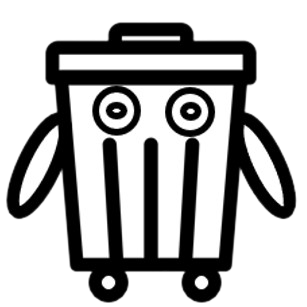
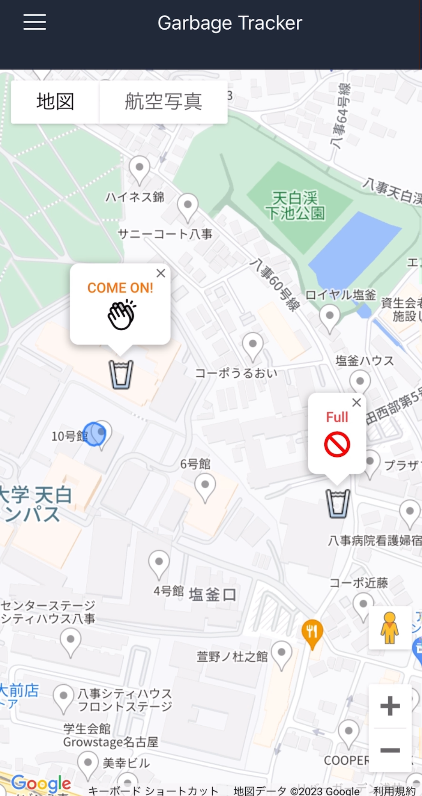

# ゴミ収集者 
作品名「ゴミ収集者」 チーム名 「Robbota」 

 

[デモビデオ]()

## 説明

「ゴミ収集者」は街中を駆け巡る自動移動ゴミ箱です。 「ゴミを捨てたい。けど捨てるところがない。」 
そんなときスマホアプリでちょろっと操作するだけであなたのもとへ駆けつけてくれます。

ゴミ収集の主な機能は以下です。
1. スマホアプリで自分の周囲に存在するゴミ収集者を追跡できます。
2. ボタンを押すことで現在あなたがいる場所まで来てくれます。距離を概算として予測時間も推定します。
3. ゴミの量を常に監視しています。満タンになった場合は巡回をやめ、ゴミ回収業者のもとへ帰ります。また危険物が投入されないよう、捨てる際はゴミの種類も確認します。

このリポジトリは大きく３つのソースコードからなります。詳細は以下のリンクを参照してください。個別に説明があります。
1. [自動運転]()
2. [ゴミ管理]()
3. [Webアプリケーション]()

## ライセンス

自動運転のリポジトリは以下のソースコードを参考に作成しました。[Spresense-microROS-Seminar](https://github.com/TE-YoshinoriOota/Spresense-microROS-Seminar). 
彼の功績に敬意を払い、本リポジトリのライセンスはこれを継承します。

## 貢献者
Ryuichi Miura ([miura123](https://github.com/miura123)) 
Kosuke Tokuda ([tokuda99](https://github.com/tokuda99)) 
Yukiya Yamamoto ([Yukiya-Yamamoto](https://github.com/Yukiya-Yamamoto))

## 問い合わせ

質問があれば以下のメールに問い合わせてください。 
kotoku9924@gmail.com.