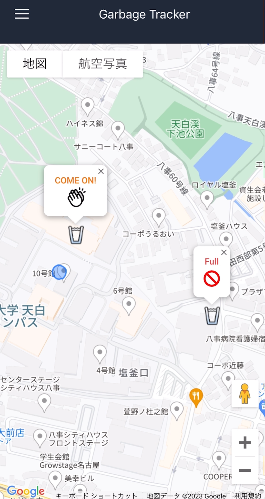

# Garbage Tracker 
Garbage Tracker, Team Robbota. 

 

[Demo Video]()

日本語の説明は[こちら](README-ja.md)
## Description

Garbage tracker is a futuristic, autonomous robotic vehicle designed to collect and dispose of garbage.

It comes equipped with the following features:
1. You can track the location of the Garbage Tracker on your smartphone.
2. It can be summoned by making a phone call, and it will come to your location.
3. It monitors the amount of garbage, and when it reaches full capacity, it autonomously returns to the waste collection facility.

This repository have 3 module. Detail is each branch.
1. [Self-driving](https://github.com/tokuda99/garbage-tracker-self-driving)
2. [Garbage manegement](https://github.com/miura123/garbage-tracker-manegement)
3. [Web app](https://github.com/tokuda99/garbage-tracker-web)

Hardware detail is following. 
[CAD](https://github.com/Yukiya-Yamamoto/garbage-tracker-hardware)

## License
This repository takes reference from [Spresense-microROS-Seminar](https://github.com/TE-YoshinoriOota/Spresense-microROS-Seminar) .
Since it was heavily inspired by the original author's work, we inherit his original LGPL-2.1 license.

## Contributors
Ryuichi Miura ([miura123](https://github.com/miura123)) 
Kosuke Tokuda ([tokuda99](https://github.com/tokuda99)) 
Yukiya Yamamoto ([Yukiya-Yamamoto](https://github.com/Yukiya-Yamamoto))
## Contacts

If you have further question, email to kotoku9924@gmail.com.